太菜了。

<!---
Sakkana/Sakkana is a ✨ special ✨ repository because its `README.md` (this file) appears on your GitHub profile.
You can click the Preview link to take a look at your changes.
- 👋 Hi, I’m @Sakkana
- 👀 I’m interested in sleeping
- 🌱 I’m currently learning sleeping
- 💞️ I’m looking to collaborate on how to fall in sleep better
- 📫 Don't reach me whicling sleeping 
--->

Coding Metrics:  

